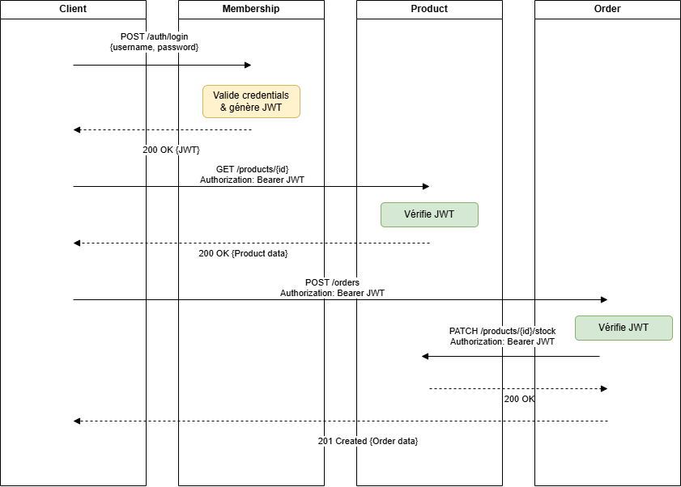

## 1. Architecture de sécurité

### Microservices

* **Membership Service**

    * Authentifie l’utilisateur
    * Génère un JWT signé avec une **clé privée RSA**

* **Product Service**

    * Vérifie les JWT avec la **clé publique RSA**

* **Order Service**

    * Vérifie les JWT avec la **clé publique RSA**

---

## 2. Diagramme de séquence de l'authentification


---

## 3. JWT

### Algorithme

* **RS256 (RSA + SHA‑256)**

### Contenu du token (claims)

```json
{
  "sub": "jean.dupont@esipen.com",
  "userId": 1,
  "roles": ["USER"],
  "iat": 1710000000,
  "exp": 1710003600
}
```

* `userId` : identifiant utilisateur
* `roles` : rôles de l’utilisateur
* `exp` : date d’expiration

---

## 4. Génération des clés RSA

Les clés sont générées une seule fois et partagées de manière sécurisée.

* **Clé privée** : utilisée uniquement par le service Membership
* **Clé publique** : utilisée par Product et Order


---

## 5. Gestion des erreurs

| Cas                 | Code HTTP        |
| ------------------- | ---------------- |
| Token absent        | 401 Unauthorized |
| Token invalide      | 401 Unauthorized |
| Token expiré        | 403 Forbidden    |
| Accès refusé (rôle) | 403 Forbidden    |
